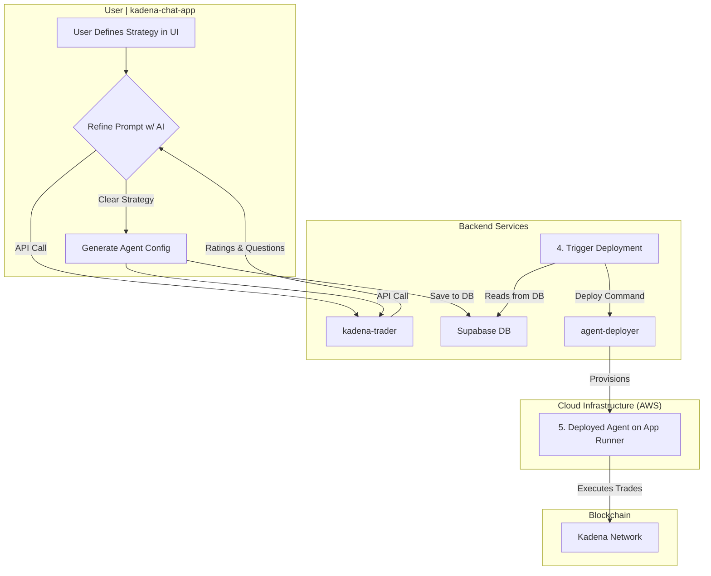

# Autonomous Trading Agents for Kadena: A Technical Whitepaper

## Bridging Natural Language and Blockchain Automation

**By XADE**

---

## Executive Summary

The democratization of blockchain trading has long been hindered by the technical complexity required to implement sophisticated trading strategies. XADE's Kadena Trading Agent Platform represents a paradigm shift in this space, introducing the first production-ready system that translates natural language trading strategies into autonomous, secure, and independently deployed blockchain agents.

This whitepaper presents a comprehensive technical analysis of a sophisticated multi-service architecture that leverages cutting-edge AI technologies to bridge the gap between human intent and blockchain execution. The platform demonstrates advanced software engineering principles applied to the complex domains of artificial intelligence and decentralized finance, showcasing:

- **AI-Driven Development Pipeline**: A revolutionary approach where Large Language Models (LLMs) serve not merely as user-facing features, but as core components of the development and deployment infrastructure itself
- **Microservices-First Architecture**: Each trading agent is deployed as an isolated, independently scalable microservice with its own dedicated wallet and execution environment
- **Infrastructure-as-Code Automation**: Fully automated deployment pipelines that provision cloud infrastructure, containerize applications, and manage secure credential distribution
- **Polyglot Engineering Excellence**: Strategic use of multiple programming languages and frameworks, each optimized for specific system requirements

The platform's technical sophistication is evidenced by its robust validation mechanisms, including multi-stage AI guardrails, syntax validation, and lint checking, ensuring that AI-generated code meets production-grade standards before deployment to live blockchain networks.

## System Architecture Overview

The Kadena Trading Agent Platform is architected as four distinct, interconnected services that collectively enable the transformation of natural language into autonomous blockchain agents:

1.  **User Interface Layer (`kadena-chat-app`)**: A React-based web application providing an intuitive multi-step wizard for agent creation and management
2.  **AI Processing Engine (`kadena-trader`)**: A Python FastAPI service implementing sophisticated prompt engineering and code generation using state-of-the-art LLMs
3.  **Blockchain Gateway (`kadena-api`)**: A Node.js Express server handling all on-chain interactions with the Kadena network
4.  **Deployment Orchestrator (`agent-deployer`)**: A containerization and cloud deployment service managing the full lifecycle of agent infrastructure

---

## Technical Implementation: Agent Lifecycle Analysis

The following technical analysis details the sophisticated multi-stage process through which natural language intent is transformed into autonomous blockchain agents. This process demonstrates the platform's advanced engineering approach, combining AI-driven development, rigorous validation mechanisms, and automated infrastructure provisioning.

### High-Level Flowchart

### Detailed Technical Process

#### 1. Intelligent User Interface Design

The user interface layer demonstrates sophisticated UX engineering through its multi-step wizard architecture. Built with React and leveraging advanced state management patterns, the interface guides users through a carefully designed flow that captures not only basic agent metadata but, critically, the natural language description of trading strategies.

**Technical Highlights:**

- **Progressive Disclosure**: Complex configuration options are revealed incrementally, reducing cognitive load
- **Real-time Validation**: Client-side validation provides immediate feedback on user input
- **State Persistence**: User progress is maintained across sessions using local storage and database synchronization

#### 2. Advanced Prompt Engineering and Refinement

The AI Processing Engine represents a breakthrough in prompt engineering methodology, implementing a sophisticated iterative refinement process that ensures natural language strategies meet the precision requirements for autonomous execution.

**Technical Architecture:**

- **LLM Integration**: Utilizes GPT-4o with carefully engineered system prompts that provide context about Kadena's token ecosystem and trading mechanics
- **Iterative Refinement Loop**: Implements a feedback mechanism where the AI evaluates prompt clarity on a 1-10 scale and generates targeted clarification questions
- **Context-Aware Analysis**: The system maintains conversation history and applies domain-specific knowledge about DeFi trading patterns

**Validation Methodology:**
The refinement process continues until the strategy description achieves sufficient clarity (rating > 6), ensuring that ambiguous instructions like "buy KDA when it drops" are refined into precise, executable parameters such as "purchase 100 KDA when the price decreases by 5% from the 24-hour high."

#### 3. Production-Grade Code Generation with Multi-Layer Validation

This stage represents the most technically sophisticated aspect of the platform: the transformation of refined natural language into production-ready JavaScript code capable of autonomous blockchain interaction.

**AI-Driven Code Generation:**

- **Template-Based Architecture**: The system provides the LLM with comprehensive JavaScript templates, Kadena API documentation, and predefined function libraries
- **Dual-Function Output**: Generates both `baselineFunction` (core trading logic) and `intervalFunction` (execution scheduling), enabling precise control over agent behavior
- **Context-Rich Prompting**: The code generation prompt includes token addresses, DEX specifications, and blockchain-specific parameters

**Multi-Stage Validation Pipeline:**
The platform implements a rigorous three-tier validation system that ensures AI-generated code meets production standards:

1. **Syntax Validation**: Uses Esprima parser to detect JavaScript syntax errors before execution
2. **Semantic Linting**: Custom regex-based analysis identifies common logical errors such as const reassignment and missing await statements
3. **AI Guardrail Correction**: A specialized "guardrail" LLM (GPT-4o) reviews the generated code and validation errors, automatically correcting issues while preserving intended functionality

**Secure Wallet Generation and Persistence:**

- **Dedicated Keypair Creation**: Each agent receives a unique Kadena wallet through a secure key generation service
- **Encrypted Storage**: Agent configurations, including private keys, are securely stored in Supabase with appropriate encryption and access controls
- **Deployment State Management**: Agents are tracked through their lifecycle with database flags enabling automated deployment orchestration

#### 4. Automated Deployment (via `agent-deployer`)

- **Deployment Trigger**: A backend process is triggered by the new entry in the Supabase table. This process reads the agent's configuration.
- **Invoke Deployer**: The trigger calls the secure `/deploy-agent` endpoint on the `agent-deployer` service, passing the agent's ID, its generated code, and its wallet keys.
- **Infrastructure as Code**: The `agent-deployer` service then executes a fully automated deployment pipeline for this single agent:
  1.  **Code Generation**: It injects the agent's JavaScript code and keys into a Node.js template.
  2.  **Containerization**: It dynamically creates a `Dockerfile` and `package.json`, then builds a Docker image containing the agent.
  3.  **Push to Registry**: It creates a dedicated repository in Amazon ECR and pushes the Docker image to it.
  4.  **Launch Service**: It provisions and deploys the container to AWS App Runner, a fully managed serverless platform. The agent's keys are securely passed as environment variables.

#### 5. Autonomous Operation (on AWS and Kadena)

- **Live Agent**: The agent is now a live, running microservice in the cloud. The `intervalFunction` it was created with dictates its execution schedule (e.g., "run every 5 minutes").
- **Execute Trades**: When scheduled, the agent executes its `baselineFunction` logic. It uses the `@kadena/client` library and its own private key to sign and send transactions directly to the Kadena blockchain via the `kadena-api` service.
- **Logging**: All agent activities and trade confirmations are captured in AWS CloudWatch for monitoring and debugging via the `agent-deployer`'s log endpoints.

## Complexity and Well-Writtenness

This platform is a showcase of advanced software engineering principles applied to the complex domains of AI and blockchain:

- **Microservices Architecture**: Each component is a distinct service with a clear responsibility, allowing for independent development, scaling, and maintenance. The deployment of each agent as its own microservice is a particularly robust and scalable design choice.
- **AI-Driven Development**: The project masterfully uses LLMs not just as a feature but as a core part of the development and deployment pipeline, translating human intent into executable code.
- **Security and Sandboxing**: Each agent is completely isolated in its own container with its own dedicated wallet. This sandboxing is critical for security in a system that handles financial transactions. Keys are managed via environment variables, a standard practice for secure credential handling.
- **Robust Automation**: The end-to-end deployment process is fully automated, from a user's click in a web app to a running service in the cloud. This demonstrates a sophisticated use of Infrastructure-as-Code (IaC) principles.
- **Polyglot Approach**: The platform intelligently uses the best language for the job: React for the dynamic frontend, Python for its mature AI ecosystem, and Node.js for its first-class support of JavaScript and Kadena's client libraries.
