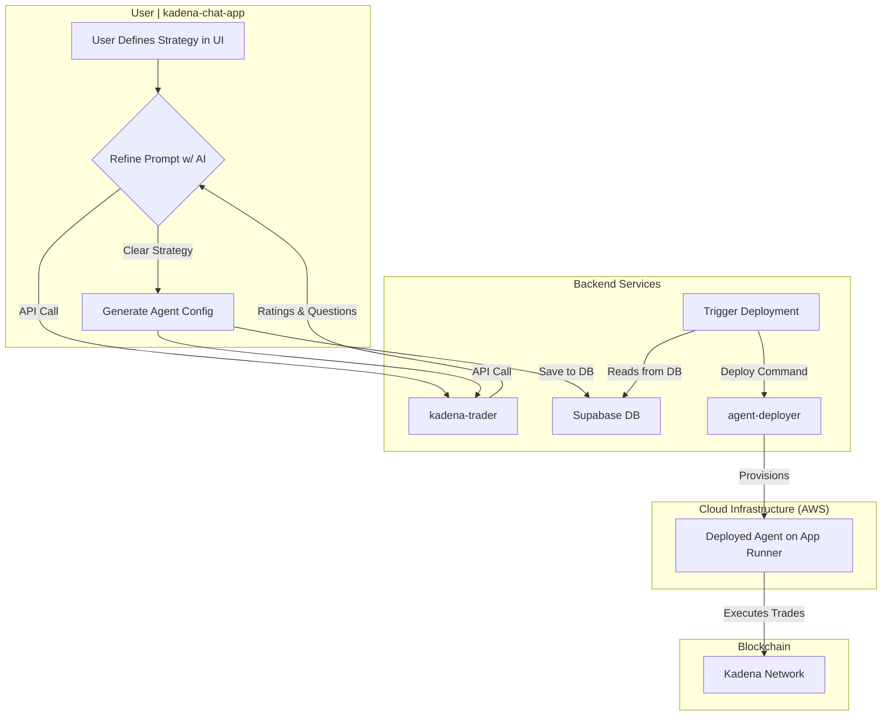

# Agent K Autonomous Trading Agents

**By XADE**

---

## Executive Summary

The democratization of blockchain trading has long been hindered by the technical complexity required to implement sophisticated trading strategies. XADE's Kadena Trading Agent Platform represents a paradigm shift in this space, introducing the first production-ready system that translates natural language trading strategies into autonomous, secure, and independently deployed blockchain agents.

This whitepaper presents a comprehensive technical analysis of a sophisticated multi-service architecture that leverages cutting-edge AI technologies to bridge the gap between human intent and blockchain execution. The platform demonstrates advanced software engineering principles applied to the complex domains of artificial intelligence and decentralized finance, showcasing:

- **AI-Driven Development Pipeline**: A revolutionary approach where Large Language Models (LLMs) serve not merely as user-facing features, but as core components of the development and deployment infrastructure itself
- **Microservices-First Architecture**: Each trading agent is deployed as an isolated, independently scalable microservice with its own dedicated wallet and execution environment
- **Infrastructure-as-Code Automation**: Fully automated deployment pipelines that provision cloud infrastructure, containerize applications, and manage secure credential distribution
- **Polyglot Engineering Excellence**: Strategic use of multiple programming languages and frameworks, each optimized for specific system requirements

The platform's technical sophistication is evidenced by its robust validation mechanisms, including multi-stage AI guardrails, syntax validation, and lint checking, ensuring that AI-generated code meets production-grade standards before deployment to live blockchain networks.

## System Architecture Overview

The Kadena Trading Agent Platform is architected as four distinct, interconnected services that collectively enable the transformation of natural language into autonomous blockchain agents:

1.  **User Interface Layer (`kadena-chat-app`)**: A React-based web application providing an intuitive multi-step wizard for agent creation and management
2.  **AI Processing Engine (`kadena-trader`)**: A Python FastAPI service implementing sophisticated prompt engineering and code generation using state-of-the-art LLMs
3.  **Blockchain Gateway (`kadena-api`)**: A Node.js Express server handling all on-chain interactions with the Kadena network
4.  **Deployment Orchestrator (`agent-deployer`)**: A containerization and cloud deployment service managing the full lifecycle of agent infrastructure

---

## Technical Implementation: Agent Lifecycle Analysis

The following technical analysis details the sophisticated multi-stage process through which natural language intent is transformed into autonomous blockchain agents. This process demonstrates the platform's advanced engineering approach, combining AI-driven development, rigorous validation mechanisms, and automated infrastructure provisioning.

### High-Level Flowchart

### Detailed Technical Process

#### 1. Intelligent User Interface Design

The user interface layer demonstrates sophisticated UX engineering through its multi-step wizard architecture. Built with React and leveraging advanced state management patterns, the interface guides users through a carefully designed flow that captures not only basic agent metadata but, critically, the natural language description of trading strategies.

**Technical Highlights:**

- **Progressive Disclosure**: Complex configuration options are revealed incrementally, reducing cognitive load
- **Real-time Validation**: Client-side validation provides immediate feedback on user input
- **State Persistence**: User progress is maintained across sessions using local storage and database synchronization

#### 2. Advanced Prompt Engineering and Refinement

The AI Processing Engine represents a breakthrough in prompt engineering methodology, implementing a sophisticated iterative refinement process that ensures natural language strategies meet the precision requirements for autonomous execution.

**Technical Architecture:**

- **LLM Integration**: Utilizes GPT-4o with carefully engineered system prompts that provide context about Kadena's token ecosystem and trading mechanics
- **Iterative Refinement Loop**: Implements a feedback mechanism where the AI evaluates prompt clarity on a 1-10 scale and generates targeted clarification questions
- **Context-Aware Analysis**: The system maintains conversation history and applies domain-specific knowledge about DeFi trading patterns

**Validation Methodology:**
The refinement process continues until the strategy description achieves sufficient clarity (rating > 6), ensuring that ambiguous instructions like "buy KDA when it drops" are refined into precise, executable parameters such as "purchase 100 KDA when the price decreases by 5% from the 24-hour high."

#### 3. Production-Grade Code Generation with Multi-Layer Validation

This stage represents the most technically sophisticated aspect of the platform: the transformation of refined natural language into production-ready JavaScript code capable of autonomous blockchain interaction.

**AI-Driven Code Generation:**

- **Template-Based Architecture**: The system provides the LLM with comprehensive JavaScript templates, Kadena API documentation, and predefined function libraries
- **Dual-Function Output**: Generates both `baselineFunction` (core trading logic) and `intervalFunction` (execution scheduling), enabling precise control over agent behavior
- **Context-Rich Prompting**: The code generation prompt includes token addresses, DEX specifications, and blockchain-specific parameters

**Multi-Stage Validation Pipeline:**
The platform implements a rigorous three-tier validation system that ensures AI-generated code meets production standards:

1. **Syntax Validation**: Uses Esprima parser to detect JavaScript syntax errors before execution
2. **Semantic Linting**: Custom regex-based analysis identifies common logical errors such as const reassignment and missing await statements
3. **AI Guardrail Correction**: A specialized "guardrail" LLM (GPT-4o) reviews the generated code and validation errors, automatically correcting issues while preserving intended functionality

**Secure Wallet Generation and Persistence:**

- **Dedicated Keypair Creation**: Each agent receives a unique Kadena wallet through a secure key generation service
- **Encrypted Storage**: Agent configurations, including private keys, are securely stored in Supabase with appropriate encryption and access controls
- **Deployment State Management**: Agents are tracked through their lifecycle with database flags enabling automated deployment orchestration

#### 4. Infrastructure-as-Code Deployment Orchestration

The deployment orchestrator represents a masterclass in automated infrastructure provisioning, implementing a complete Infrastructure-as-Code (IaC) pipeline that transforms validated agent configurations into live, scalable cloud services.

**Event-Driven Architecture:**

- **Database Triggers**: Deployment is initiated through database change events, ensuring immediate response to agent creation
- **Secure API Gateway**: The deployment service exposes authenticated endpoints with comprehensive request validation and logging

**Containerization Pipeline:**
The deployment process demonstrates advanced DevOps practices through its automated containerization workflow:

1. **Dynamic Code Injection**: Agent-specific JavaScript code is injected into a Node.js runtime template with health check endpoints for AWS App Runner compatibility
2. **Dependency Management**: Automatically generates `package.json` with required Kadena client libraries and runtime dependencies
3. **Multi-Architecture Support**: Builds Docker images with platform-specific optimizations for AWS infrastructure

**Cloud Infrastructure Provisioning:**

- **Amazon ECR Integration**: Creates dedicated container repositories for each agent with automated authentication and image lifecycle management
- **AWS App Runner Deployment**: Provisions fully managed serverless compute instances with automatic scaling and load balancing
- **Secure Environment Configuration**: Implements secure credential injection through environment variables with AWS IAM role-based access control

#### 5. Autonomous Blockchain Execution and Monitoring

The culmination of the platform's technical sophistication is demonstrated in the autonomous operation phase, where deployed agents execute sophisticated trading strategies with full blockchain integration and comprehensive observability.

**Autonomous Execution Architecture:**

- **Scheduled Operations**: Agents operate according to their generated `intervalFunction`, enabling precise timing control for trading strategies
- **Blockchain Integration**: Direct integration with Kadena networks through the official `@kadena/client` library, ensuring compatibility and reliability
- **Transaction Signing**: Secure, isolated transaction signing using agent-specific private keys within containerized environments

**Observability and Monitoring:**

- **Comprehensive Logging**: All agent activities are captured in AWS CloudWatch with structured logging for analysis and debugging
- **Real-time Monitoring**: The platform provides real-time access to agent logs through RESTful endpoints with filtering and pagination capabilities
- **Performance Metrics**: Detailed execution metrics enable optimization of trading strategies and system performance

## Technical Excellence and Innovation

The Kadena Trading Agent Platform exemplifies technical excellence across multiple dimensions, representing a significant advancement in the intersection of AI and blockchain technology:

**Architectural Sophistication:**
The microservices-first architecture demonstrates exceptional engineering judgment, with each agent deployed as an isolated, independently scalable service. This design choice enables unprecedented flexibility in agent management while maintaining security through complete sandboxing.

**AI Integration Innovation:**
The platform's use of LLMs transcends typical AI applications, integrating artificial intelligence directly into the development and deployment pipeline. This represents a paradigm shift where AI becomes infrastructure, not merely a feature.

**Security-First Design:**
The platform implements defense-in-depth security principles, with agent isolation, secure credential management, and encrypted storage. Each agent operates with its own dedicated wallet and execution environment, eliminating cross-contamination risks.

**Operational Excellence:**
The fully automated deployment pipeline showcases Infrastructure-as-Code best practices, enabling zero-touch deployment from natural language to live blockchain agents. This level of automation, combined with comprehensive monitoring and logging, demonstrates production-grade operational maturity.

**Engineering Polyglotism:**
The strategic use of multiple programming languages—React for responsive user interfaces, Python for AI processing, and Node.js for blockchain integration—demonstrates sophisticated technical decision-making that optimizes each component for its specific requirements.
